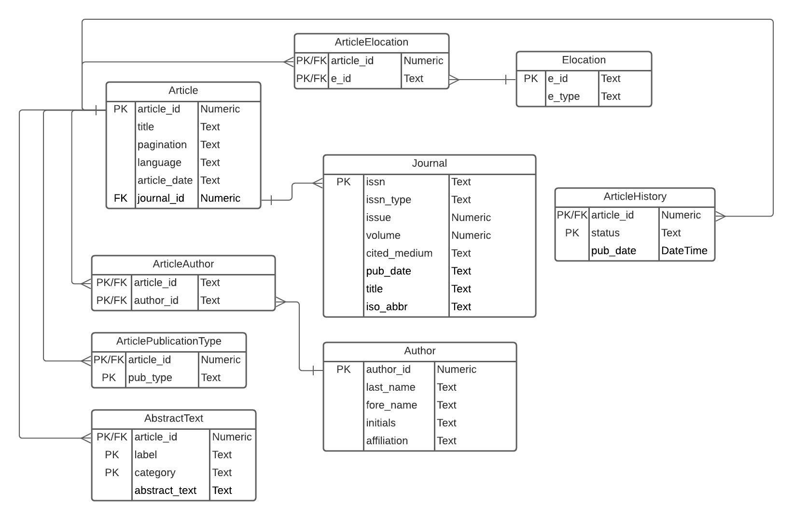

## ERD


## Importing required libraries
```{r}
library(xml2)
library(RSQLite)
```

## Setting up Connection to Database and Parsing XML
```{r}
path <- "/home/yashk/Documents/DBMS-Workspace/DBMS-Practicum-2/"
fn <- "pubmed_sample.xml"
fpn = paste0(path, fn)

# Reading the XML file and parse into DOM
xmlDOM <- xmlParse(file = fpn)
root <- xmlRoot(xmlDOM)
a <- read_xml(fpn)
#xml_structure(a)
dbfile = "Parcticum2.sqlite"

# if database file already exists, we connect to it, otherwise
# we create a new database
dbcon <- dbConnect(RSQLite::SQLite(), paste0(path,dbfile))
```

## Dropping all Tables in the Database
```{sql connection=dbcon}
DROP TABLE IF EXISTS Article;
```

```{sql connection=dbcon}
DROP TABLE IF EXISTS ArticleElocation;
```

```{sql connection=dbcon}
DROP TABLE IF EXISTS Elocation;
```

```{sql connection=dbcon}
DROP TABLE IF EXISTS ArticleAuthor;
```

```{sql connection=dbcon}
DROP TABLE IF EXISTS Journal;
```

```{sql connection=dbcon}
DROP TABLE IF EXISTS ArticleHistory;
```

```{sql connection=dbcon}
DROP TABLE IF EXISTS ArticlePublicationType;
```

```{sql connection=dbcon}
DROP TABLE IF EXISTS Author;
```

```{sql connection=dbcon}
DROP TABLE IF EXISTS AbstractText;
```

## Creating Journal Table
```{sql connection=dbcon}
CREATE TABLE IF NOT EXISTS Journal(
issn TEXT,
issn_type TEXT,
issue TEXT,
volume NUMBER,
cited_medium TEXT,
pub_date TEXT,
title TEXT,
iso_abbr TEXT,
PRIMARY KEY(issn)
);
```

## Creating Article Table
```{sql connection=dbcon}
CREATE TABLE IF NOT EXISTS Article(
article_id NUMBER,
title TEXT,
pagination TEXT,
language TEXT,
article_date TEXT,
journal_id NUMBER,
PRIMARY KEY(article_id),
FOREIGN KEY(journal_id) REFERENCES Journal(journal_id)
);
```

## Creating Elocation Table
```{sql connection=dbcon}
CREATE TABLE IF NOT ExISTS Elocation(
e_id TEXT,
e_type TEXT,
PRIMARY KEY(e_id)
);
```

## Creating ArticleElocation Table
```{sql connection=dbcon}
CREATE TABLE IF NOT EXISTS ArticleElocation(
  article_id NUMBER,
  e_id TEXT,
  PRIMARY KEY(article_id, e_id),
  FOREIGN KEY(article_id) REFERENCES Article(article_id),
  FOREIGN KEY(e_id) REFERENCES Elocation(e_id)
);
```

## Creating AbstarctText table
```{sql connection=dbcon}
CREATE TABLE IF  NOT EXISTS AbstractText(
  article_id NUMBER  NOT NULL,
  label TEXT NOT NULL,
  category TEXT NOT NULL,
  abstract_text TEXT NOT NULL,
  PRIMARY KEY(article_id, label, category)  
);
```

## Creating Auhtor table
```{sql connection=dbcon}
CREATE TABLE IF  NOT EXISTS Author(
  author_id NUMBER AUTO_INCREMENT,
  last_name TEXT,
  fore_name TEXT,
  initials TEXT,
  affiliations TEXT ,
  PRIMARY KEY(author_id)  
);
```

## Creating ArticleAuthor table
```{sql connection=dbcon}
CREATE TABLE IF  NOT EXISTS ArticleAuthor(
  article_id NUMBER NOT NULL,
  author_id NUMBER  NOT NULL,
  PRIMARY KEY(author_id, article_id),
  FOREIGN KEY(article_id) REFERENCES Article(article_id),
  FOREIGN KEY(author_id) REFERENCES Author(author_id)
);
```

## Creating ArticlePublicationType
```{sql connection=dbcon}
CREATE TABLE IF  NOT EXISTS ArticleAuthor(
  article_id NUMBER NOT NULL,
  pub_type TEXT  NOT NULL,
  PRIMARY KEY(article_id, pub_type),
  FOREIGN KEY(article_id) REFERENCES Article(article_id)
);
```

## Creating ArticleHistory
```{sql connection=dbcon}
CREATE TABLE IF  NOT EXISTS ArticleHistory(
  article_id NUMBER NOT NULL,
  status TEXT  NOT NULL,
  pub_date DATE,
  PRIMARY KEY(article_id, status),
  FOREIGN KEY(article_id) REFERENCES Article(article_id)
);
```

```{sql connection=dbcon}

```
```{sql connection=dbcon}

```
```{sql connection=dbcon}

```
```{sql connection=dbcon}

```

## Working with the xml
```{r}
```


## Closing connection to database and freeing the pointer to the parsed XML
```{r}
free(xmlDOM)
dbDisconnect(dbcon)
```

