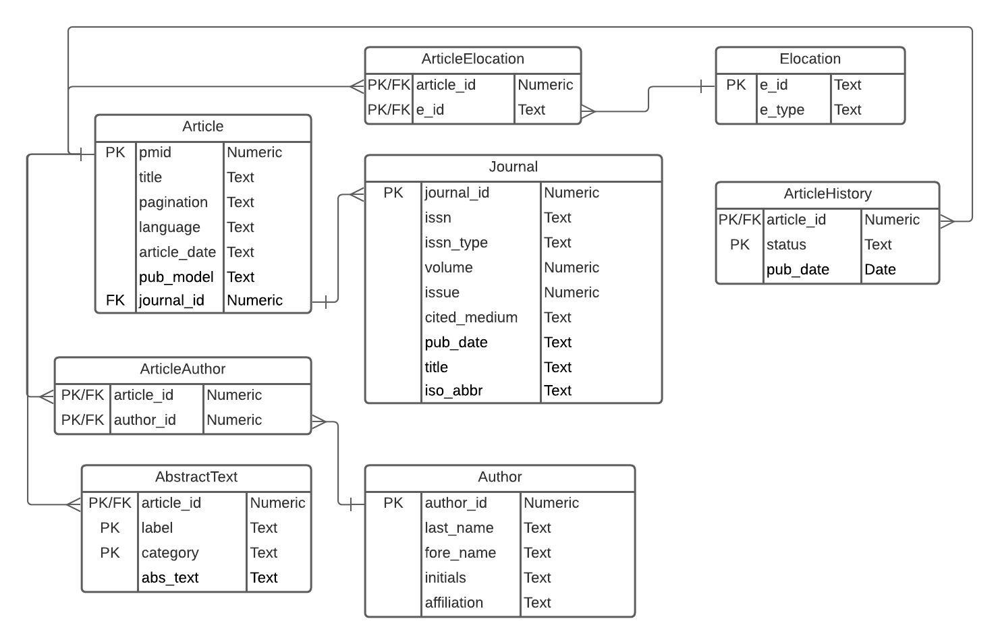
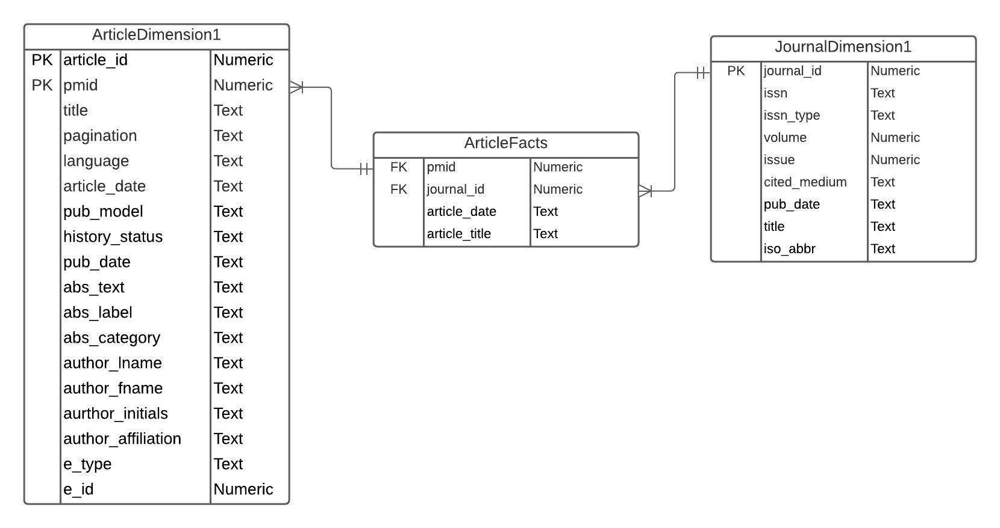
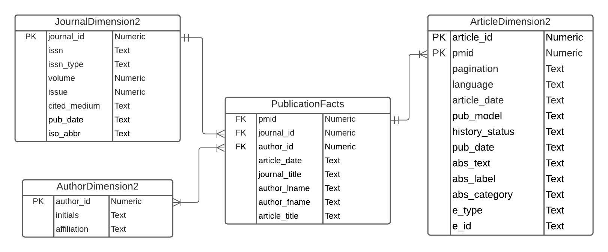

## ERD


## Importing required libraries
```{r}
library(xml2)
library(dplyr)
library(RSQLite)
library(sqldf)
library(XML)

```

## Setting up Connection to Database and Parsing XML
```{r}
#path<- "/Users/sanyamharne/Desktop/practicum2/"
path <- "/home/yashk/Documents/DBMS-Workspace/DBMS-Practicum-2/"
fn <- "pubmed_sample.xml"
fpn = paste0(path, fn)

# Reading the XML file and parse into DOM
xmlDOM <- xmlParse(file = fpn)
root <- xmlRoot(xmlDOM)
a <- read_xml(fpn)
#xml_structure(a)
dbfile = "Parcticum2.sqlite"

# if database file already exists, we connect to it, otherwise
# we create a new database
dbcon <- dbConnect(RSQLite::SQLite(), paste0(path,dbfile))
```

## Dropping all Tables in the Database
```{sql connection=dbcon}
DROP TABLE IF EXISTS Article;
```

```{sql connection=dbcon}
DROP TABLE IF EXISTS ArticleElocation;
```

```{sql connection=dbcon}
DROP TABLE IF EXISTS Elocation;
```

```{sql connection=dbcon}
DROP TABLE IF EXISTS ArticleAuthors;
```

```{sql connection=dbcon}
DROP TABLE IF EXISTS Journal;
```

```{sql connection=dbcon}
DROP TABLE IF EXISTS ArticleHistory;
```

```{sql connection=dbcon}
DROP TABLE IF EXISTS ArticlePublicationType;
```

```{sql connection=dbcon}
DROP TABLE IF EXISTS Author;
```

```{sql connection=dbcon}
DROP TABLE IF EXISTS AbstractText;
```

## Creating Journal Table
```{sql connection=dbcon}
CREATE TABLE IF NOT EXISTS Journal(
journal_id NUMBER,
issn TEXT,
issn_type TEXT,
volume NUMBER,
issue NUMBER,
cited_medium TEXT,
pub_date TEXT,
title TEXT,
iso_abbr TEXT,
PRIMARY KEY(journal_id)
);
```

## Creating Article Table
```{sql connection=dbcon}
CREATE TABLE IF NOT EXISTS Article(
pmid NUMBER,
title TEXT,
pagination TEXT,
language TEXT,
article_date TEXT,
pub_model TEXT,
journal_id NUMBER,
PRIMARY KEY(pmid),
FOREIGN KEY(journal_id) REFERENCES Journal(journal_id)
);
```

## Creating Elocation Table
```{sql connection=dbcon}
CREATE TABLE IF NOT EXISTS Elocation(
e_id TEXT,
e_type TEXT,
PRIMARY KEY(e_id)
);
```

## Creating ArticleElocation Table
```{sql connection=dbcon}
CREATE TABLE IF NOT EXISTS ArticleElocation(
  article_id NUMBER,
  e_id TEXT,
  PRIMARY KEY(article_id, e_id),
  FOREIGN KEY(article_id) REFERENCES Article(pmid),
  FOREIGN KEY(e_id) REFERENCES Elocation(e_id)
);
```

## Creating AbstractText table
```{sql connection=dbcon}
CREATE TABLE IF  NOT EXISTS AbstractText(
  article_id NUMBER  NOT NULL,
  label TEXT,
  category TEXT,
  abs_text TEXT NOT NULL,
  PRIMARY KEY(article_id, label, category),
  FOREIGN KEY(article_id) REFERENCES Article(pmid)
);
```

## Creating Auhtor table
```{sql connection=dbcon}
CREATE TABLE IF  NOT EXISTS Author(
  author_id NUMBER,
  last_name TEXT,
  fore_name TEXT,
  initials TEXT,
  affiliation TEXT,
  PRIMARY KEY(author_id)
);
```

## Creating ArticleAuthor table
```{sql connection=dbcon}
CREATE TABLE IF  NOT EXISTS ArticleAuthor(
  article_id NUMBER NOT NULL,
  author_id NUMBER  NOT NULL,
  PRIMARY KEY(author_id, article_id),
  FOREIGN KEY(article_id) REFERENCES Article(pmid),
  FOREIGN KEY(author_id) REFERENCES Author(author_id)
);
```

## Creating ArticleHistory
```{sql connection=dbcon}
CREATE TABLE IF  NOT EXISTS ArticleHistory(
  article_id NUMBER NOT NULL,
  status TEXT  NOT NULL,
  pub_date DATE,
  PRIMARY KEY(article_id, status),
  FOREIGN KEY(article_id) REFERENCES Article(pmid)
);
```


## Extracting the Journal table from XML
```{r}
xpathEx1<- "//Journal/ISSN"
Journal<-data.frame(xpathSApply(root,xpathEx1,xmlValue))
names(Journal)[1]<-"issn"
xpathEx2<- "//Journal/ISSN[@IssnType]"
issn_type<-xpathSApply(root,xpathEx2,xmlGetAttr,"IssnType")
Journal$issn_type <- issn_type
xpathEx2<- "//Journal/JournalIssue/Volume"
volume<- xpathSApply(root,xpathEx2,xmlValue)
Journal$journal_volume<- volume
xpathEx2<- "//Journal/JournalIssue/Issue"
issue<- xpathSApply(root,xpathEx2,xmlValue)
Journal$journal_issue<- issue
xpathEx2<- "//Journal/JournalIssue[@CitedMedium]"
cited_medium<-xpathSApply(root,xpathEx2,xmlGetAttr,"CitedMedium")
Journal$cited_medium <- cited_medium

#extracting pub date
xpathEx2 <-"//Journal/JournalIssue/PubDate"
node<-xpathApply(root,xpathEx2)

year <- xmlSApply(node, function(x)xmlValue(x[['Year']]))
month <-xmlSApply(node, function(x)xmlValue(x[['Month']]))
day<-xmlSApply(node, function(x)xmlValue(x[['Day']]))
medlinedate <- xmlSApply(node, function(x)xmlValue(x[['MedlineDate']]))
n<- length(year)
pub_date<-c(1:n)
for (m in 1:n) {
  if(is.na(year[m])){
    pub_date[m]<-medlinedate[m]
  }
  else{
    if(!is.na(month[m])){
      if(is.na(day[m])){
        pub_date[m]<-paste(year[m],month[m],sep = " ")
      }
      else{
        pub_date[m]<-paste(year[m],month[m],day[m],sep = " ")
      }
    }
  }
}

Journal$pub_date<-pub_date
#Extracting title and iso_abbr
xpathEx2 <-"//Journal"
node<-xpathApply(root,xpathEx2)
title <- xmlSApply(node, function(x)xmlValue(x[['Title']]))
Journal$title<- title
iso_abbr<-xmlSApply(node, function(x)xmlValue(x[['ISOAbbreviation']]))
Journal$iso_abbr<-iso_abbr
Journal$journal_id <- c(1:length(Journal$issn))
head(Journal)
```

## Extracting the Author table from the XML
```{r}
node <- xpathApply(root, "//Author")
last_name <- xmlSApply(node, function(x)xmlValue(x[['LastName']]))
author_id <- c(1: length(last_name))*0
fore_name <- xmlSApply(node, function(x)xmlValue(x[['ForeName']]))
initials <- xmlSApply(node, function(x)xmlValue(x[['Initials']]))
affiliation <- xmlSApply(node, function(x)xmlValue(x[['Affiliation']]))
Author <- data.frame(author_id = author_id,
                    last_name = last_name,
                    fore_name = fore_name,
                    initials = initials,
                    affiliation = affiliation,
                    stringsAsFactors = F)
a <- Author[!is.na(Author$affiliation),]
b <- a[!duplicated(a[, 2:3]),]
Author <- unique(Author[,1:4])
Author$author_id <- c(1:length(Author[,1]))
Author$affiliation <- NA
names(b)[names(b) == "affiliation"] <- "c"
for(i in 1:nrow(b)){
  a = b[i,]$fore_name
  Author$affiliation[Author$fore_name == a & Author$last_name == b[i,]$last_name] <- b[i,]$c
}
head(Author)
```

## Extracting the Article table from the XML
```{r}
node <- xpathApply(root, "//MedlineCitation")
pmid <- xmlSApply(node, function(x)xmlValue(x[['PMID']]))
node <- xpathApply(root, "//Article")
title <- xmlSApply(node, function(x)xmlValue(x[['ArticleTitle']]))
node <- xpathApply(root, "//Article/Pagination")
pagination <- xmlSApply(node, function(x)xmlValue(x[['MedlinePgn']]))
node <- xpathApply(root, "//Article")
language <- xmlSApply(node, function(x)xmlValue(x[['Language']]))

#extracting date in the proper format


article_date <- xmlSApply(node, function(x)xmlValue(x[['ArticleDate']]))
year<- substr(article_date,1,4)
month<-substr(article_date,5,6)
day<- substr(article_date,7,8)
article_date <- paste(year,month,day,sep = "-")
article_date[article_date == "NA-NA-NA"] <- NA
node <- xpathApply(root, "//Article/Journal")
journalid <- xmlSApply(node, function(x)xmlValue(x[['ISSN']]))
node <- xpathApply(root, "//Article/Journal/JournalIssue")
journal_volume <- xmlSApply(node, function(x)xmlValue(x[['Volume']]))
journal_issue <- xmlSApply(node, function(x)xmlValue(x[['Issue']]))
xpath <- "//Article[@PubModel]"
pub_model <- xpathSApply(root,xpath,xmlGetAttr,"PubModel")

Article <- data.frame(pmid = pmid,
                      title = title,
                      pagination = pagination,
                      language = language,
                      article_date = article_date,
                      pub_model = pub_model,
                      issn = journalid,
                      journal_volume = journal_volume,
                      journal_issue = journal_issue,
                      stringsAsFactors = F)
Article <- inner_join(Article, Journal, by = c("issn", "journal_volume", "journal_issue")) %>% select(!c(issn, journal_issue, journal_volume, issn_type))
Article <- Article %>% select(!c(cited_medium, pub_date, title.y, iso_abbr))
head(Article)
```

## Extracting Eloaction table from XML
```{r}
xpathEx1 <- "//Article/ELocationID"
Elocation<- data.frame(xpathSApply(root,xpathEx1,xmlValue)) 
xpathEx1 <- "//Article/ELocationID[@EIdType]"
e_type<- xpathSApply(root,xpathEx1,xmlGetAttr, "EIdType")
names(Elocation)[1]<-"e_id"
Elocation$e_type<-e_type
head(Elocation)
```

## Extracting AbstractText table from XML
```{r}
#Node by Node traversal to get the correct artile id for the abstract text
xpathEx1<-"//MedlineCitation/PMID"
pmid<-xpathSApply(root,xpathEx1,xmlValue)
xpath<-"//Abstract/AbstractText"
AbstractText<-data.frame(xpathSApply(root,xpath,xmlValue))
names(AbstractText)[1]<-"abs_text"

m=1
for(k in 1:19){
  a<-pmid[k]
  xpath<- sprintf("//MedlineCitation[PMID= %s]//Abstract/AbstractText", a)
  txt<-xpathSApply(root,xpath,xmlValue)
  
  xpath<- sprintf("//MedlineCitation[PMID= %s]//Abstract/AbstractText[@Label]", a)
  label<-xpathSApply(root,xpath,xmlGetAttr,"Label")
  
  xpath<- sprintf("//MedlineCitation[PMID= %s]//Abstract/AbstractText[@NlmCategory]", a)
  nlmcategory<-xpathSApply(root,xpath,xmlGetAttr,"NlmCategory")
  if(length(txt)==1){
      AbstractText$label[m]=NA
      AbstractText$nlmcategory[m]=NA
      m=m+1
  }
  else{
    c=1 
    while(c<=length(txt)){
      AbstractText$pmid[m]<-pmid[k]
      AbstractText$label[m]<-label[c]
      AbstractText$nlmcategory[m]<- nlmcategory[c]
      #abstract_text$abs_text[m]<- txt[c]
      m=m+1
      c=c+1
    }
  }
}
head(AbstractText)
```

## Extracting ArticleHistory table from the XML
```{r}
#Node by Node traversal to get the correct artile id for the abstract text
xpathEx1<-"//MedlineCitation/PMID"
pmid<-xpathSApply(root,xpathEx1,xmlValue)
xpath<-"//History/PubMedPubDate[@PubStatus]"
status <- xpathSApply(root,xpath,xmlGetAttr,"PubStatus")
#Extracting date in the proper format
xpathEx2 <-"//History/PubMedPubDate"
node<-xpathApply(root,xpathEx2)


year <- xmlSApply(node, function(x)xmlValue(x[['Year']]))
month <-xmlSApply(node, function(x)xmlValue(x[['Month']]))
day<-xmlSApply(node, function(x)xmlValue(x[['Day']]))

pub_date<- paste(year,month,day,sep = "-")
ArticleHistory<-data.frame(status = status,
                           pub_date = pub_date,
                           stringsAsFactors = F)
ArticleHistory$pmid <- c(1:length(ArticleHistory$status))
m=1
for(k in 1:length(pmid)){
  a <- pmid[k]
  xpath <- sprintf("//PubmedArticle[MedlineCitation/PMID= %s]//History/PubMedPubDate[@PubStatus]", a)
  status <- xpathSApply(root,xpath,xmlGetAttr, "PubStatus")
  status
  c=1
  while(c<=length(status)){
    ArticleHistory$pmid[m] <- pmid[k]
    m=m+1
    c=c+1
  }
}
head(ArticleHistory)
```

## Extracting the ArticleAuthor
```{r}
xpathEx1 = "//AuthorList/Author/LastName"
last_name <- xpathSApply(root, xpathEx1, xmlValue)
xpathEx1 = "//AuthorList/Author/ForeName "
fore_name <- xpathSApply(root, xpathEx1, xmlValue)
ArticleAuthors<- data.frame(last_name = last_name,
                             fore_name = fore_name,
                             stringsAsFactors = F)

#Node by Node traversal to get the correct artile id for the abstract text
xpathEx1<-"//MedlineCitation/PMID"
pmid<-xpathSApply(root,xpathEx1,xmlValue)
ArticleAuthors$pmid <- c(1:length(ArticleAuthors$last_name))
m = 1
for(k in 1:length(ArticleAuthors$last_name)){
  a<-pmid[k]
  xpath<- sprintf("//MedlineCitation[PMID= %s]//Author/LastName", a)
  auth<-xpathSApply(root,xpath,xmlValue)
  c = 1
  while(c<=length(auth)){
    ArticleAuthors$pmid[m] <- pmid[k]
    m=m+1
    c=c+1
  }
}
ArticleAuthors <- inner_join(Author, ArticleAuthors, by = c("last_name", "fore_name")) %>% select(pmid, author_id)
head(ArticleAuthors)
```

## Extracting ArticleElocation
```{r}
xpathEx1 = "//ELocationID"
e_id <- xpathSApply(root, xpathEx1, xmlValue)
ArticleElocation <- data.frame(e_id = e_id, stringsAsFactors = F)
#Node by Node traversal to get the correct artile id for the abstract text
xpathEx1<-"//MedlineCitation/PMID"
pmid<-xpathSApply(root,xpathEx1,xmlValue)
ArticleElocation$pmid <- c(1:length(ArticleElocation$e_id))
m = 1
for(k in 1:length(ArticleElocation$e_id)){
  a<-pmid[k]
  xpath<- sprintf("//MedlineCitation[PMID= %s]/Article/ELocationID", a)
  e_id<-xpathSApply(root,xpath,xmlValue)
  c = 1
  if(length(e_id)==1){
    ArticleElocation$pmid[m] <- pmid[k]
    m=m+1
    c=c+1
  }
  else{
     while(c<=length(e_id)){
      ArticleElocation$pmid[m] <- pmid[k]
      m=m+1
      c=c+1
    }
  }
}
head(ArticleElocation)
```

## Populating Database
```{r}
Journal <- Journal[, c(9, 1, 2, 3, 4, 5, 6, 7, 8)]
names(Journal) <- c("journal_id", "issn", "issn_type", "volume", "issue", "cited_medium", "pub_date", "title", "iso_abbr")
dbWriteTable(dbcon, name = "Journal", value = Journal, append = TRUE,row.names=FALSE)
names(Article) <- c("pmid", "title", "pagination", "language", "article_date", "pub_model", "journal_id")
dbWriteTable(dbcon, name = "Article", value = Article, append = TRUE,row.names=FALSE)
names(Elocation) <- c("e_id", "e_type")
dbWriteTable(dbcon, name = "Elocation", value = Elocation, append = TRUE,row.names=FALSE)
ArticleElocation <- ArticleElocation[, c(2, 1)]
names(ArticleElocation) <- c("article_id", "e_id")
dbWriteTable(dbcon, name = "ArticleElocation", value = ArticleElocation, append = TRUE,row.names=FALSE)
AbstractText <- AbstractText[, c(2, 3, 4, 1)]
names(AbstractText) <- c("article_id", "label", "category", "abs_text")
dbWriteTable(dbcon, name = "AbstractText", value = AbstractText, append = TRUE,row.names=FALSE)
dbWriteTable(dbcon, name = "Author", value = Author, append = TRUE,row.names=FALSE)
names(ArticleAuthors) <- c("article_id", "author_id")
dbWriteTable(dbcon, name = "ArticleAuthors", value = ArticleAuthors, append = TRUE,row.names=FALSE)
ArticleHistory <- ArticleHistory[, c(3, 1, 2)]
names(ArticleHistory) <- c("article_id", "status", "pub_date")
dbWriteTable(dbcon, name = "ArticleHistory", value = ArticleHistory, append = TRUE,row.names=FALSE)
```

## Checking if Database Populated Correctly
```{sql connection=dbcon}
SELECT * FROM Journal LIMIT 5;
```

```{sql connection=dbcon}
SELECT * FROM Article LIMIT 5;
```

```{sql connection=dbcon}
SELECT * FROM Elocation LIMIT 5;
```

```{sql connection=dbcon}
SELECT * FROM ArticleElocation LIMIT 5;
```

```{sql connection=dbcon}
SELECT * FROM AbstractText LIMIT 5;
```

```{sql connection=dbcon}
SELECT * FROM ArticleAuthors LIMIT 5;
```

```{sql connection=dbcon}
SELECT * FROM Author LIMIT 5 ;
```

# Section 2 Creating FactTables

## Dropping tables
```{sql connection=dbcon}
DROP TABLE IF EXISTS ArticleFacts;
```

```{sql connection=dbcon}
DROP TABLE IF EXISTS ArticleF1;
```

```{sql connection=dbcon}
DROP TABLE IF EXISTS JournalF1;
```

# Part 2 FactTables and Star Schema

## 1st FactTable
## ERD


## Creating ArticleF1 table
```{sql connection=dbcon}
CREATE TABLE IF NOT EXISTS ArticleF1(
article_id NUMBER,
pmid NUMBER,
pagination TEXT,
language TEXT,
article_date TEXT,
pub_model TEXT,
history_status TEXT,
pub_date TEXT,
abs_text TEXT,
abs_label TEXT,
abs_category TEXT,
author_lname TEXT,
author_fname TEXT,
author_initials TEXT,
author_affiliation TEXT,
e_type TEXT,
e_id NUMBER,
PRIMARY KEY(article_id, pmid)
);
```

## Creating JournalF1 table
```{sql connection=dbcon}
CREATE TABLE IF NOT EXISTS JournalF1(
journal_id NUMBER NOT NULL,
issn TEXT,
issn_type TEXT,
volume NUMBER,
issue NUMBER,
cited_medium TEXT,
pub_date TEXT,
title TEXT,
iso_abbr TEXT,
PRIMARY KEY(journal_id)
);
```

## Creating ArticleFacts
```{sql connection=dbcon}
CREATE TABLE IF NOT EXISTS ArticleFacts(
pmid NUMBER,
journal_id NUMBER,
article_date TEXT,
article_title TEXt,
FOREIGN KEY(pmid) REFERENCES ArticleF1(pmid),
FOREIGN KEY(journal_id) REFERENCES JournalF1(journal_id)
);
```

## Populating ArticleF1 Table
```{r}
ArticleF1 <- sqldf("SELECT pmid, pagination, language, article_date, pub_model, status AS history_status, ArticleHistory.pub_date, abs_text, label AS 'abs_label', category AS 'abs_category', last_name AS 'author_lname', fore_name AS 'author_fname', initials AS 'author_initials', affiliation AS 'author_affiliation', Elocation.e_type, Elocation.e_id
FROM Article INNER JOIN ArticleHistory ON Article.pmid = ArticleHistory.article_id INNER JOIN AbstractText ON Article.pmid = AbstractText.article_id INNER JOIN ArticleAuthors ON Article.pmid = ArticleAuthors.article_id INNER JOIN Author ON ArticleAuthors.author_id = Author.author_id INNER JOIN ArticleElocation ON Article.pmid = ArticleElocation.article_id INNER JOIN Elocation ON ArticleElocation.e_id = Elocation.e_id;")
ArticleF1$article_id <- c(1:length(ArticleF1$pmid))
ArticleF1 <- ArticleF1[,c(17, 1, 2, 3, 4, 5, 6, 7, 8, 9, 10, 11, 12, 13, 14, 15, 16)]
dbWriteTable(dbcon, name = "ArticleF1", value = ArticleF1, append = TRUE,row.names=FALSE)
```

```{sql connection=dbcon}
SELECT * FROM ArticleF1 LIMIT 5;
```

## Populating JournalF2 Table
```{r}
JournalF1 <- Journal
dbWriteTable(dbcon, name = "JournalF1", value = JournalF1, append = TRUE,row.names=FALSE)
```

```{sql connection=dbcon}
SELECT * FROM JournalF1 LIMIT 5;
```

## Populating ArticleFacts Table
```{r}
ArticleFacts <- sqldf("SELECT pmid, Journal.journal_id, pub_date as 'article_date', Article.title AS 'article_title' FROM Article INNER JOIN Journal ON Article.journal_id = Journal.journal_id")
dbWriteTable(dbcon, name = "ArticleFacts", value = ArticleFacts, append = TRUE,row.names=FALSE)
```

```{sql connection=dbcon}
SELECT * FROM ArticleFacts LIMIT 5;
```

## 2nd FactTable
## ERD


## Dropping tables
```{sql connection=dbcon}
DROP TABLE IF EXISTS PublicationFacts;
```

```{sql connection=dbcon}
DROP TABLE IF EXISTS ArticleF2;
```

```{sql connection=dbcon}
DROP TABLE IF EXISTS JournalF2;
```

```{sql connection=dbcon}
DROP TABLE IF EXISTS AuthorF2;
```

## Creating ArticleF2 table
```{sql connection=dbcon}
CREATE TABLE IF NOT EXISTS ArticleF2(
article_id NUMBER,
pmid NUMBER,
pagination TEXT,
language TEXT,
article_date TEXT,
pub_model TEXT,
history_status TEXT,
pub_date TEXT,
abs_text TEXT,
abs_label TEXT,
abs_category TEXT,
e_type TEXT,
e_id NUMBER,
PRIMARY KEY(article_id, pmid)
);
```

## Creating JournalF2 table
```{sql connection=dbcon}
CREATE TABLE IF NOT EXISTS JournalF2(
journal_id NUMBER NOT NULL,
issn TEXT,
issn_type TEXT,
volume NUMBER,
issue NUMBER,
cited_medium TEXT,
pub_date TEXT,
iso_abbr TEXT,
PRIMARY KEY(journal_id)
);
```

## Creating AuthorF2 table
```{sql connection=dbcon}
CREATE TABLE IF NOT EXISTS AuthorF2(
  author_id NUMBER,
  initials TEXT,
  affiliation TEXT,
  PRIMARY KEY(author_id)
);
```

## Creating PublicationFacts
```{sql connection=dbcon}
CREATE TABLE IF NOT EXISTS PublicationFacts(
pmid NUMBER,
journal_id NUMBER,
author_id NUMBER,
article_date TEXT,
journal_title TEXT,
author_lname TEXT,
author_fname TEXT,
article_title TEXT,
FOREIGN KEY(pmid) REFERENCES ArticleF2(pmid),
FOREIGN KEY(journal_id) REFERENCES JournalF2(journal_id),
FOREIGN KEY(author_id) REFERENCES AuthorF2(author_id)
);
```

## Populating ArticleF2 Table
```{r}
ArticleF2 <- sqldf("SELECT pmid, pagination, language, article_date, pub_model, status AS history_status, ArticleHistory.pub_date, abs_text, label AS 'abs_label', category AS 'abs_category', Elocation.e_type, Elocation.e_id
FROM Article INNER JOIN ArticleHistory ON Article.pmid = ArticleHistory.article_id INNER JOIN AbstractText ON Article.pmid = AbstractText.article_id INNER JOIN ArticleElocation ON Article.pmid = ArticleElocation.article_id INNER JOIN Elocation ON ArticleElocation.e_id = Elocation.e_id;")
ArticleF2$article_id <- c(1:length(ArticleF2$pmid))
ArticleF2 <- ArticleF2[,c(13, 1, 2, 3, 4, 5, 6, 7, 8, 9, 10, 11, 12)]
dbWriteTable(dbcon, name = "ArticleF2", value = ArticleF2, append = TRUE,row.names=FALSE)
```

```{sql connection=dbcon}
SELECT * FROM ArticleF2 LIMIT 5;
```

## Populating JournalF2 Table
```{r}
JournalF2 <- Journal[,c(1, 2, 3, 4, 5, 6, 7, 9)]
dbWriteTable(dbcon, name = "JournalF2", value = JournalF2, append = TRUE,row.names=FALSE)
```

```{sql connection=dbcon}
SELECT * FROM JournalF2 LIMIT 5;
```

## Populating AuthorF2 Table
```{r}
AuthorF2 <- Author[, c(1, 4, 5)]
dbWriteTable(dbcon, name = "AuthorF2", value = AuthorF2, append = TRUE,row.names=FALSE)
```

```{sql connection=dbcon}
SELECT * FROM AuthorF2 LIMIT 5;
```

## Populating PublicationFacts Table
```{r}
PublicationFacts <- sqldf("SELECT pmid, Journal.journal_id, Author.author_id, Journal.pub_date AS 'article_date', Journal.title AS 'journal_title', Author.last_name AS 'author_lname', Author.fore_name AS 'author_fname', Article.title AS 'article_title' FROM Article INNER JOIN Journal ON Article.journal_id = Journal.journal_id INNER JOIN ArticleAuthors ON Article.pmid = ArticleAuthors.article_id INNER JOIN Author ON ArticleAuthors.author_id = Author.author_id")
dbWriteTable(dbcon, name = "PublicationFacts", value = PublicationFacts, append = TRUE,row.names=FALSE)
```

```{sql connection=dbcon}
SELECT * FROM PublicationFacts LIMIT 5;
```

## Section 3: Data analysis
```{r}
seasonal_pattern <- data.frame(quarter = c("Jan-Mar", "Apr-June", "July-Sept", "Oct-Dec"), stringsAsFactors = F)
a <- sqldf("SELECT article_date FROM ArticleFacts")
a <- data.frame(months = substr(a[,], 6, 8))
seasonal_pattern$numOfPubs <- 0
seasonal_pattern[1, "numOfPubs"] = sqldf("SELECT count(*) FROM a WHERE months LIKE 'Jan' OR months LIKE 'Feb' OR months LIKE 'Mar' OR months == ''")
seasonal_pattern[2, "numOfPubs"] = sqldf("SELECT count(*) FROM a WHERE months LIKE 'Apr' OR months LIKE 'May' OR months LIKE 'Jun'")
seasonal_pattern[3, "numOfPubs"] = sqldf("SELECT count(*) FROM a WHERE months LIKE 'Jul' OR months LIKE 'Aug' OR months LIKE 'Sep'")
seasonal_pattern[4, "numOfPubs"] = sqldf("SELECT count(*) FROM a WHERE months LIKE 'Oct' OR months LIKE 'Nov' OR months LIKE 'Dec'")
names(seasonal_pattern) <- c("quarter", "Number of Publications")
publicationsPerAuthor <- sqldf("SELECT author_lname, author_fname, COUNT(*) AS 'Number of Publications' FROM PublicationFacts GROUP BY author_fname, author_lname")
publicationsPerJournal <- sqldf("SELECT journal_title, COUNT(DISTINCT pmid) AS 'Number of Publications' FROM PublicationFacts GROUP BY journal_title")

#Finding Monthly pattern
monthly_pattern <- sqldf("SELECT *, count(*) FROM a GROUP BY months")
monthly_pattern <- monthly_pattern[c(6, 5, 9, 2, 10, 8, 7, 3, 12, 1, 11, 4),]
monthly_pattern[10, "months"] = "Oct"
names(monthly_pattern) <- c("month", "Number of Publications")

# Finding Yearly pattern
b <- sqldf("SELECT article_date FROM ArticleFacts")
b <- data.frame(year = substr(b[,], 1,4))
yearly_pattern <- data.frame(year = c("2012", "2013"), stringsAsFactors = F)
yearly_pattern$numOfPubs<-0
yearly_pattern[1, "numOfPubs"] = sqldf("SELECT count(*) FROM b WHERE year LIKE '2012' OR year LIKE '12'")
yearly_pattern[2, "numOfPubs"] = sqldf("SELECT count(*) FROM b WHERE year LIKE '2013'")
names(yearly_pattern) <- c("year", "Number of Publications")

head(seasonal_pattern)
monthly_pattern
yearly_pattern
head(publicationsPerAuthor)
head(publicationsPerJournal)
```

## Part 3: 2. Plotting/Visualizing the analysis
```{r}
barplot(seasonal_pattern$'Number of Publications', names.arg = seasonal_pattern$quarter, main = "Seasonal Pattern of Publications per quarter", xlab = "Quarters", ylab = "Number of Publications")
barplot(monthly_pattern$'Number of Publications', names.arg = monthly_pattern$month, main = " Pattern of Publications per month", xlab = "Months", ylab = "Number of Publications")
barplot(yearly_pattern$'Number of Publications', names.arg = yearly_pattern$year, main = " Pattern of Publications per year", xlab = "Years", ylab = "Number of Publications")
```


## Closing connection to database and freeing the pointer to the parsed XML
```{r}
free(xmlDOM)
dbDisconnect(dbcon)
```
